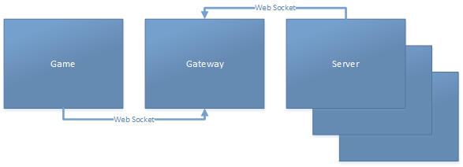

# xbx / No Lives Worth Saving

## Game

Built on Pixi.JS (WebGL)

## Gateway

Built on SignalR (WebSockets)

## Server

Built on Azure Service Fabric (Microservices)

## Development Setup

PixiJS require to be hosted, not loaded locally from disk:

```
npm install http-server -g
```

Navigate the root folder and run

```
npm start
```

Which will run http-server and serve the src folder.

Navigate to:

[http://localhost:5000](http://localhost:5000)

## Public Endpoints

### Game URL
[https://xbx.azurewebsites.net/](https://xbx.azurewebsites.net/)

### Gateway Hubs URL
[https://xbx-gateway.azurewebsites.net/ws/hubs](https://xbx-gateway.azurewebsites.net/ws/hubs)


## Architecture

The main architecture principles for the game, and for anyone who want to develop for it, and/or host their own servers, this is important knowledge.

Any number of servers running the Azure Service Fabric code, or a future third
party developed server, connects to the public (or private) gateway and registers itself to receive data from the gateway, and makes the server available as an option for users joining the game.

A user can pick from a selection of active servers when starting a new game. An unique identifier for each users on each server is generated and used by the server to identify a player. This ID is different from each server for privacy reasons.

This architecture allows anyone to host any number of instances of the game, of the gateway and of the server. In the public hosted instance of game, gateway and server, there might be restrictions on server registrations to avoid spamming, advertisement and for security reasons.




## License
    
MIT © [Sondre Bjellås](http://sondreb.com)
